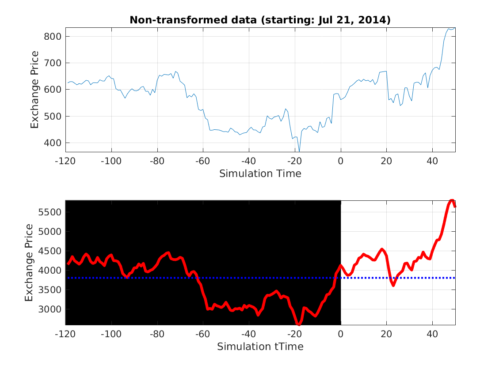

# Trading_Simulator_PANIC
Crypto/USD trading pair simulations, for risky day-trading training.

## Introduction

Early P4N!C simulator research, identifying the appropriate data transformations that mask temporal context without overly-obfuscating information that must be retained for trading indicators. This was some light basic research behind our interactive gamified training simulator. See subfolder containing demo figures. Contact mitchellpkt for details about front-end implementation (proprietary)

Back-end code here snips out a few-month window randomly from the coin's exchange rate history, scales it to current spot price for recontextualization, then mixes in a noise vector to obfuscate particularly identifiable features that could unintentionally reveal the time frame.

## Example
This figure shows the P4N!C window (after a game has been completed). The spot price was just shy of $4000 when these figures were generated, so the raw data (originally ~$600) has been correspondingly scaled to that price on day 0. 

The black-background days (-120 - 0) are four months of "pre-simulation" data that initially pshown to the user, who then interactively trades through the following month (0 - 30).

